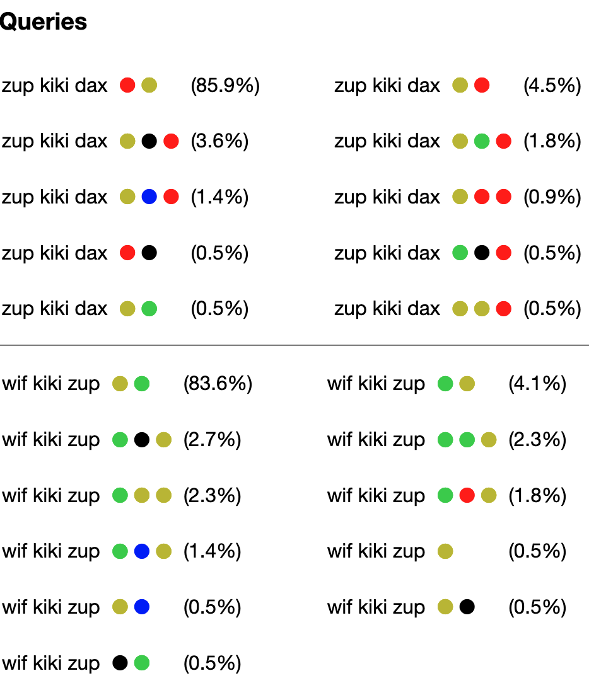
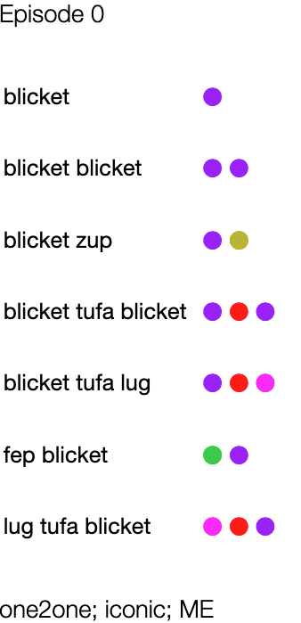

# Behaviorally-Informed Meta-Learning (BIML)

BIML is a meta-learning approach for guiding neural networks to human-like systematic generalization and inductive biases, through high-level guidance or direct human examples. This code shows how to train and evaluate a sequence-to-sequence (seq2seq) transformer in PyTorch to implement BIML through memory-based meta-learning.

This code accompanies the following submitted paper.
- Lake, B. M. and Baroni, M. (submitted). Human-like systematic generalization through a meta-learning neural network.   

You can email brenden AT nyu.edu if you would like a copy.

### Credits
This repo borrows from the excellent [PyTorch seq2seq tutorial](https://pytorch.org/tutorials/beginner/translation_transformer.html).

### Requirements
Python 3 with the following packages:
torch (PyTorch), sklearn (scikit-learn), numpy, matplotlib

### Downloading data and pre-trained models

**Meta-training data**  
To get the episodes used for meta-training, you should download the following [zip file](https://cims.nyu.edu/~brenden/supplemental/BIML-large-files/data_algebraic.zip) with the 100K meta-training episodes. Please extract `data_algebraic.zip` such that `data_algebraic`is a sub-directory of the main repo.

**Pre-trained models**  
To get the top pre-trained models, you should download the following [zip file](https://cims.nyu.edu/~brenden/supplemental/BIML-large-files/BIML_top_models.zip). Please extract `BIML_top_models.zip` such that `out_models` is a sub-directory of the main repo and contains the model files `net-*.pt`.

### Evaluating models
There are many different ways to evaluate a model after training. Here are a few examples.

**Generating algebraic outputs on few-shot learning task**  
Here we find the best response from the pre-trained BIML model using greedy decoding:
```python
python eval.py  --max --episode_type few_shot_gold --fn_out_model net-BIML-top.pt --verbose
```

**Evaluating human responses on few-shot learning task (using log-likelihood)**  
Here we evaluate the log-likelihood of the human data:
```python
python eval.py  --ll --ll_nrep 100 --episode_type few_shot_human --ll_p_lapse 0.03 --fn_out_model net-BIML-top.pt
```
To evaluate the log-likelihood of all models and to reproduce Figure 4B in the manuscript, you can run this command for the various models. Please see the table below for how to set the arguments in each case. Note that due to system/version differences, the log-likelihood values may vary in minor ways from the paper.  

| --fn_out_model            | --ll_p_lapse | --episode_type |
|---------------------------|--------------|----------------|
| net-basic-seq2seq-top.pt  | 0.9          |human_vanilla   |
| net-BIML-copy-top.pt      | 0.5          |few_shot_human  |
| net-BIML-algebraic-top.pt | 0.1          |few_shot_human  |
| net-BIML-joint-top.pt     | 0.03         |few_shot_human  |
| net-BIML-top.pt           | 0.03         |few_shot_human  |


**Sampling model responses for the few-shot learning task**  
The models can be asked to mimic human responses on few-shot learning. To do so, the models sample from their distribution of possible outputs. A full set of samples from the models is available on [this webpage](https://cims.nyu.edu/~brenden/supplemental/BIML-supp-results/sysgen.html). To reproduce the results for BIML (or other models), you can type the following to generate a HTML page.
```python
python eval.py --episode_type few_shot_human_mult10 --sample_html --fn_out_model net-BIML-top.pt
```
Then, after ensuring the right file name is at top of script, you can compare the human and machine mistakes
```python
cd html_output/few_shot_human_mult10
python analysis_few_shot.py
```
This should reproduce the hosted HTML file and numbers reported in the paper. Variations are possible due to version differences.

```
Human responses (item accuracy):
   DAX after 1 : 86.364
  ...
  mean overall acc.: 80.739
  mean acc. on simple queries: 85.479
  mean acc. on complex queries: 76.0
  mean acc. on len=6 queries: 72.5
  perc. of errors that are one2one:  24.39 ; 10 of 41
  perc. of errors (involving "after") that are iconic :  23.333 ; 7 of 30
Model responses (item accuracy):
   DAX after 1 : 85.909
  ...
  mean overall acc.: 82.376
  mean acc. on simple queries: 86.252
  mean acc. on complex queries: 78.5
  mean acc. on len=6 queries: 77.75
  perc. of errors that are one2one:  56.267 ; 211 of 375
  perc. of errors (involving "after") that are iconic :  13.83 ; 39 of 282

Correlation for item accuracies: r= 0.788 ; p= 0.007
Generating HTML file: human_few_shot_behavior.html
```

**Sampling model responses for the open-ended task**  
The models can be asked to mimic human responses on the open-ended task. Again, a full set of samples from the models is available on [this webpage](https://cims.nyu.edu/~brenden/supplemental/BIML-supp-results/sysgen.html). To reproduce the results for BIML, you can type the following two commands to generate a HTML page.
```python
python eval.py --episode_type open_end_freeform --sample_iterative --fn_out_model net-BIML-open-ended-top.pt
```
Then, after ensuring the right file name is at top of script, execute:
```python
cd html_output/open_end_freeform
python analysis_freeform.py
```
This should reproduce the hosted HTML file and numbers reported in the paper. Variations are possible due to version differences.

```
Human:
   Processing 29 human participants.
   Percent with perfect maps (consistent with 3 inductive biases): 58.621 ; N= 17 of 29
   Percent with one2one maps: 62.069 ; N= 18 of 29
   Percent with iconic concatenation: 79.31 ; N= 23 of 29
   Percent with ME maps: 93.103 ; N= 27 of 29
Model:
   Processing 100 model samples.
   Percent with perfect maps (consistent with 3 inductive biases): 65.0 ; N= 65 of 100
   Percent with one2one maps: 66.0 ; N= 66 of 100
   Percent with iconic concatenation: 85.0 ; N= 85 of 100
   Percent with ME maps: 99.0 ; N= 99 of 100
Generating HTML file: human_open_end_freeform.html
Generating HTML file: open_end_freeform_net-BIML-open-ended-top.html
```

The full set of evaluation arguments can be viewed with when typing `python eval.py -h`:
```
optional arguments:
  -h, --help            show this help message and exit
  --fn_out_model FN_OUT_MODEL
                        *REQUIRED*. Filename for loading the model
  --dir_model DIR_MODEL
                        Directory for loading the model file
  --max_length_eval MAX_LENGTH_EVAL
                        Maximum generated sequence length
  --batch_size BATCH_SIZE
                        Number of episodes in batch
  --episode_type EPISODE_TYPE
                        What type of episodes do we want? See datasets.py for
                        options
  --dashboard           Showing loss curves during training.
  --ll                  Evaluate log-likelihood of validation (val) set
  --max                 Find best outputs for val commands (greedy decoding)
  --sample              Sample outputs for val commands
  --sample_html         Sample outputs for val commands in html format (using
                        unmap to canonical text)
  --sample_iterative    Sample outputs for val commands iteratively
  --fit_lapse           Fit the lapse rate
  --ll_nrep LL_NREP     Evaluate each episode this many times when computing
                        log-likelihood (needed for stochastic remappings)
  --ll_p_lapse LL_P_LAPSE
                        Lapse rate when evaluating log-likelihoods
  --verbose             Inspect outputs in more detail
```

### Episode types
Please see `datasets.py` for the full set of options. Here are a few key episode types that can be set via `--episode_type`:
- `algebraic+biases` : Corresponds to "BIML" in Table 4B and main results
- `algebraic_noise` : Corresponds to "BIML (algebraic only)" in Table 4B and main results
- `retrieve` : Correspond to "BIML (copy only)" in Table 4B and main results
- `few_shot_gold` : For evaluating BIML on the gold algebraic responses for the few-shot learning task. This episode type provides the test set only.
- `few_shot_human` : For evaluating BIML on predicting human responses for the few-shot learning task. This episode type provides the test set only.
- `few_shot_human_mult10` : Same as above for evaluating BIML on predicting human responses, although with each human response included 10x.
- `open_end_freeform` : For evaluating models productions on open-ended task. Here, the models iteratively fill out responses one-by-one.

### Training models from scratch
To train BIML on few-shot learning (as in the BIML model in Fig. 2 and Table 4B), you can run the train command with default arguments:
```python
python train.py --episode_type algebraic+biases --fn_out_model net-BIML.pt
```
which will produce a file `out_models/net-BIML.pt`. 

The full set of training arguments can be viewed with `python train.py -h`:
```
optional arguments:
  -h, --help            show this help message and exit
  --fn_out_model FN_OUT_MODEL
                        *REQUIRED* Filename for saving model checkpoints.
                        Typically ends in .pt
  --dir_model DIR_MODEL
                        Directory for saving model files
  --episode_type EPISODE_TYPE
                        What type of episodes do we want? See datasets.py for
                        options
  --batch_size BATCH_SIZE
                        number of episodes per batch
  --nepochs NEPOCHS     number of training epochs
  --lr LR               learning rate
  --lr_end_factor LR_END_FACTOR
                        factor X for decrease learning rate linearly from
                        1.0*lr to X*lr across training
  --no_lr_warmup        Turn off learning rate warm up (by default, we use 1
                        epoch of warm up)
  --nlayers_encoder NLAYERS_ENCODER
                        number of layers for encoder
  --nlayers_decoder NLAYERS_DECODER
                        number of layers for decoder
  --emb_size EMB_SIZE   size of embedding
  --ff_mult FF_MULT     multiplier for size of the fully-connected layer in
                        transformer
  --dropout DROPOUT     dropout applied to embeddings and transformer
  --act ACT             activation function in the fully-connected layer of
                        the transformer (relu or gelu)
  --save_best           Save the "best model" according to validation loss.
  --save_best_skip SAVE_BEST_SKIP
                        Do not bother saving the "best model" for this
                        fraction of early training
  --resume              Resume training from a previous checkpoint
```                       